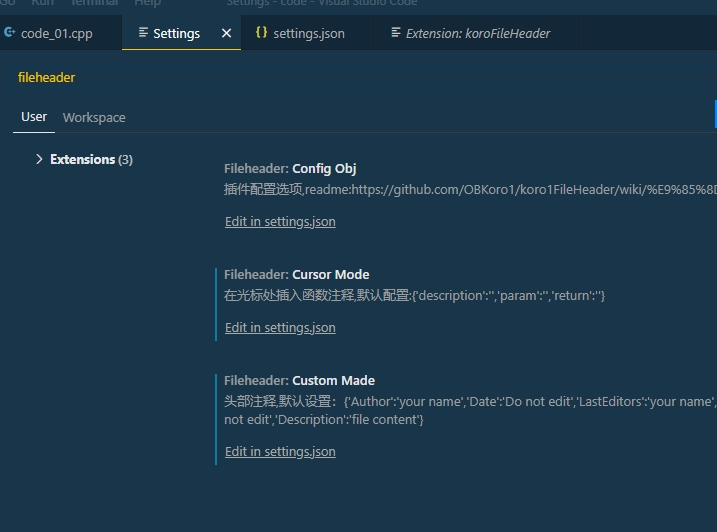

# vscode注释插件

> Author: liuxiao
>
> Date: 2021.10.10

1. **安装插件KoroFileHeader**

   

2. **打开Settings，查找fileheader**

   

   - 文件头部注释：**Fileheader:custom Made**
   - 函数注释：**Fileheader:cursor Mode**

3. **点击哪个"在setting.json"中编辑，输入以下设置后保存，然后重启vscode更新设置**

   

4. **测试**

   

   