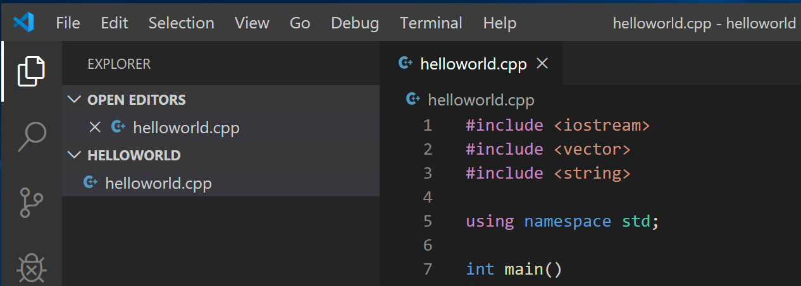
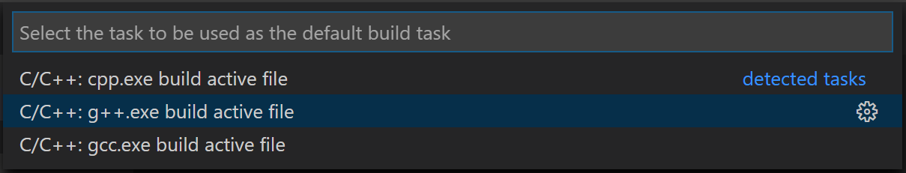
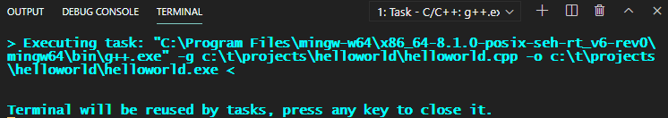
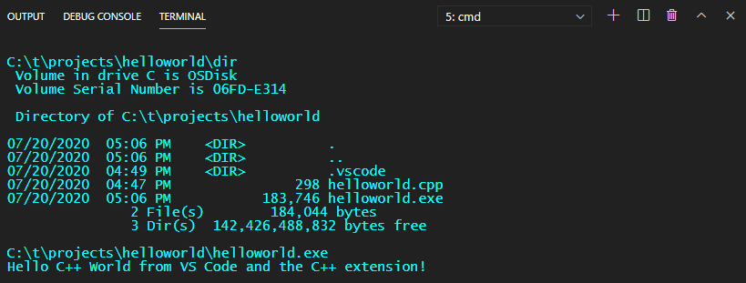
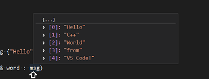
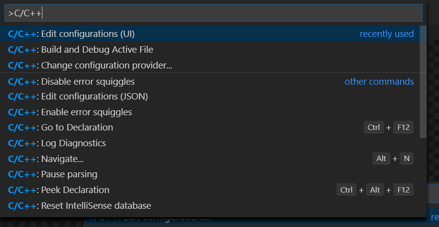
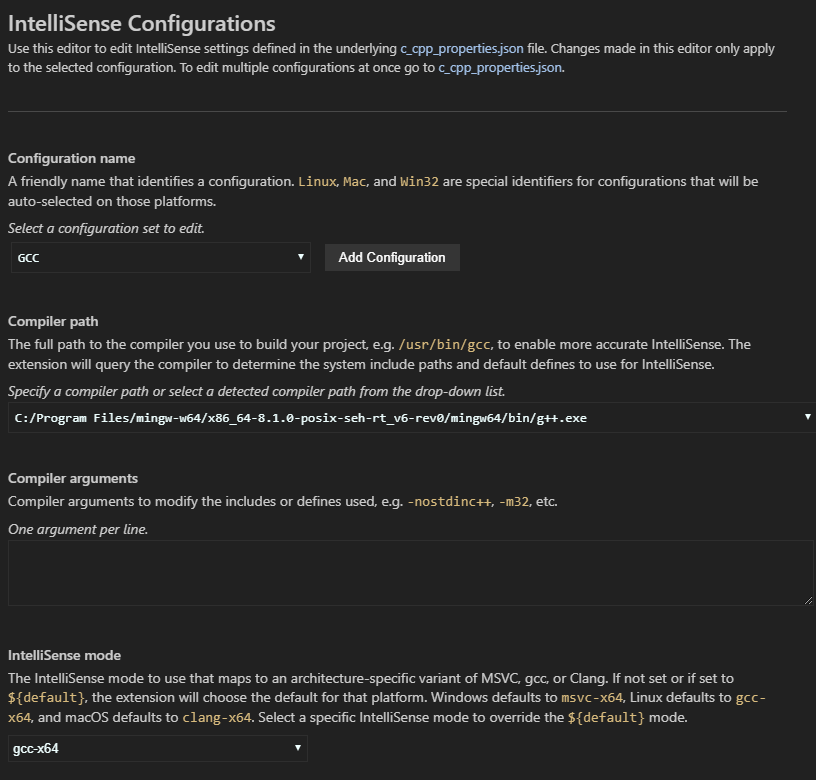

# Using GCC with MinGW

> author : 刘笑
>
> date : 2020.11.15
>
> remarks : 纯官方配置文档（个人感觉还是官方的看得懂~~）
>
> origin links : https://code.visualstudio.com/docs/cpp/config-mingw


In this tutorial, you configure Visual Studio Code to use the GCC C++ compiler (g++) and GDB debugger from [mingw-w64](http://mingw-w64.org/doku.php/start) to create programs that run on Windows.

After configuring VS Code, you will compile and debug a simple Hello World program in VS Code. This tutorial does not teach you about GCC, GDB, Mingw-w64, or the C++ language. For those subjects, there are many good resources available on the Web.

If you have any problems, feel free to file an issue for this tutorial in the [VS Code documentation repository](https://github.com/microsoft/vscode-docs/issues).


## Prerequisites

To successfully complete this tutorial, you must do the following steps:

1. Install [Visual Studio Code](https://code.visualstudio.com/download).

2. Install the [C/C++ extension for VS Code](https://marketplace.visualstudio.com/items?itemName=ms-vscode.cpptools). You can install the C/C++ extension by searching for 'c++' in the Extensions view (Ctrl+Shift+X).

   

3. Install Mingw-w64 via the SourceForge website. Click [Mingw-w64](https://sourceforge.net/projects/mingw-w64/files/Toolchains%20targetting%20Win32/Personal%20Builds/mingw-builds/installer/mingw-w64-install.exe/download) to download the Windows Mingw-w64 installer.

   1. Run the installer.
   2. For **Architecture** select **x86_64** and then select **Next**.
   3. **Next** again to use the default installation folder and install MinGW.

4. Add the path to your Mingw-w64 `bin` folder to the Windows `PATH` environment variable by using the following steps:

   1. In the Windows search bar, type 'settings' to open your Windows Settings.
   2. Search for **Edit environment variables for your account**.
   3. Choose the `Path` variable and then select **Edit**.
   4. Select **New** and add the Mingw-w64 path to the system path. The exact path depends on which version of Mingw-w64 you have installed and where you installed it. If you used the settings above to install Mingw-w64, then add this to the path: `C:\Program Files\mingw-w64\x86_64-8.1.0-posix-seh-rt_v6-rev0\mingw64\bin`.
   5. Select **OK** to save the updated PATH. You will need to reopen any console windows for the new PATH location to be available.

### Check your MinGW installation

To check that your Mingw-w64 tools are correctly installed and available, open a new Command Prompt and type:

```
g++ --version
gdb --version
```

If you don't see the expected output or `g++` or `gdb` is not a recognized command, check your installation (Windows **Control Panel** > **Programs**) and make sure your PATH entry matches the Mingw-w64 binary location where the compilers are located.


## Create Hello World

From a Windows command prompt, create an empty folder called `projects` where you can place all your VS Code projects. Then create a sub-folder called `helloworld`, navigate into it, and open VS Code in that folder by entering the following commands:

```
mkdir projects
cd projects
mkdir helloworld
cd helloworld
code .
```

The "code ." command opens VS Code in the current working folder, which becomes your "workspace". As you go through the tutorial, you will see three files created in a `.vscode` folder in the workspace:

- `tasks.json` (build instructions)
- `launch.json` (debugger settings)
- `c_cpp_properties.json` (compiler path and IntelliSense settings)

### Add a source code file

In the File Explorer title bar, select the **New File** button and name the file `helloworld.cpp`.


### Add hello world source code

Now paste in this source code:

```c++
#include <iostream>
#include <vector>
#include <string>

using namespace std;

int main()
{
    vector<string> msg {"Hello", "C++", "World", "from", "VS Code", "and the C++ extension!"};

    for (const string& word : msg)
    {
        cout << word << " ";
    }
    cout << endl;
}
```

Now press Ctrl+S to save the file. Notice how the file you just added appears in the **File Explorer** view (Ctrl+Shift+E) in the side bar of VS Code:



You can also enable [Auto Save](https://code.visualstudio.com/docs/editor/codebasics#_saveauto-save) to automatically save your file changes, by checking **Auto Save** in the main **File** menu.

The Activity Bar on the far left lets you open different views such as **Search**, **Source Control**, and **Run**. You'll look at the **Run** view later in this tutorial. You can find out more about the other views in the VS Code [User Interface documentation](https://code.visualstudio.com/docs/getstarted/userinterface).

> **Note**: When you save or open a C++ file, you may see a notification from the C/C++ extension about the availability of an Insiders version, which lets you test new features and fixes. You can ignore this notification by selecting the `X` (**Clear Notification**).


## Explore IntelliSense

In your new `helloworld.cpp` file, hover over `vector` or `string` to see type information. After the declaration of the `msg` variable, start typing `msg.` as you would when calling a member function. You should immediately see a completion list that shows all the member functions, and a window that shows the type information for the `msg` object:


You can press the Tab key to insert the selected member; then, when you add the opening parenthesis, you will see information about any arguments that the function requires.


## Build helloworld.cpp

Next, you'll create a `tasks.json` file to tell VS Code how to build (compile) the program. This task will invoke the g++ compiler to create an executable file based on the source code.

From the main menu, choose **Terminal** > **Configure Default Build Task**. In the dropdown, which will display a tasks dropdown listing various predefined build tasks for C++ compilers. Choose **g++.exe build active file**, which will build the file that is currently displayed (active) in the editor.



This will create a `tasks.json` file in a `.vscode` folder and open it in the editor.

Your new `tasks.json` file should look similar to the JSON below:

```json
{
  "version": "2.0.0",
  "tasks": [
    {
      "type": "shell",
      "label": "C/C++: g++.exe build active file",
      "command": "C:\\Program Files\\mingw-w64\\x86_64-8.1.0-posix-seh-rt_v6-rev0\\mingw64\\bin\\g++.exe",
      "args": ["-g", "${file}", "-o", "${fileDirname}\\${fileBasenameNoExtension}.exe"],
      "options": {
        "cwd": "${workspaceFolder}"
      },
      "problemMatcher": ["$gcc"],
      "group": {
        "kind": "build",
        "isDefault": true
      }
    }
  ]
}
```

The `command` setting specifies the program to run; in this case that is g++. The `args` array specifies the command-line arguments that will be passed to g++. These arguments must be specified in the order expected by the compiler. This task tells g++ to take the active file (`${file}`), compile it, and create an executable file in the current directory (`${fileDirname}`) with the same name as the active file but with the `.exe` extension (`${fileBasenameNoExtension}.exe`), resulting in `helloworld.exe` for our example.

> **Note**: You can learn more about `task.json` variables in the [variables reference](https://code.visualstudio.com/docs/editor/variables-reference).

The `label` value is what you will see in the tasks list; you can name this whatever you like.

The `"isDefault": true` value in the `group` object specifies that this task will be run when you press Ctrl+Shift+B. This property is for convenience only; if you set it to false, you can still run it from the Terminal menu with **Tasks: Run Build Task**.

### Running the build

1. Go back to `helloworld.cpp`. Your task builds the active file and you want to build `helloworld.cpp`.

2. To run the build task defined in `tasks.json`, press Ctrl+Shift+B or from the **Terminal** main menu choose **Run Build Task**.

3. When the task starts, you should see the Integrated Terminal panel appear below the source code editor. After the task completes, the terminal shows output from the compiler that indicates whether the build succeeded or failed. For a successful g++ build, the output looks something like this:

   

4. Create a new terminal using the **+** button and you'll have a new terminal with the `helloworld` folder as the working directory. Run `dir` and you should now see the executable `helloworld.exe`.

   

5. You can run `helloworld` in the terminal by typing `helloworld.exe` (or `.\helloworld.exe` if you use a PowerShell terminal).

> **Note**: You might need to press Enter a couple of times initially to see the PowerShell prompt in the terminal. This issue should be fixed in a future release of Windows.

### Modifying tasks.json

You can modify your `tasks.json` to build multiple C++ files by using an argument like `"${workspaceFolder}\\*.cpp"` instead of `${file}`. This will build all `.cpp` files in your current folder. You can also modify the output filename by replacing `"${fileDirname}\\${fileBasenameNoExtension}.exe"` with a hard-coded filename (for example `"${workspaceFolder}\\myProgram.exe"`).


## Debug helloworld.cpp

Next, you'll create a `launch.json` file to configure VS Code to launch the GDB debugger when you press F5 to debug the program.

1. From the main menu, choose **Run** > **Add Configuration...** and then choose **C++ (GDB/LLDB)**.
2. You'll then see a dropdown for various predefined debugging configurations. Choose **g++.exe build and debug active file**.


VS Code creates a `launch.json` file, opens it in the editor, and builds and runs 'helloworld'.

```json
{
  "version": "0.2.0",
  "configurations": [
    {
      "name": "g++.exe - Build and debug active file",
      "type": "cppdbg",
      "request": "launch",
      "program": "${fileDirname}\\${fileBasenameNoExtension}.exe",
      "args": [],
      "stopAtEntry": false,
      "cwd": "${workspaceFolder}",
      "environment": [],
      "externalConsole": false,
      "MIMode": "gdb",
      "miDebuggerPath": "C:\\Program Files\\mingw-w64\\x86_64-8.1.0-posix-seh-rt_v6-rev0\\mingw64\\bin\\gdb.exe",
      "setupCommands": [
        {
          "description": "Enable pretty-printing for gdb",
          "text": "-enable-pretty-printing",
          "ignoreFailures": true
        }
      ],
      "preLaunchTask": "C/C++: g++.exe build active file"
    }
  ]
}
```

The `program` setting specifies the program you want to debug. Here it is set to the active file folder `${fileDirname}` and active filename with the `.exe` extension `${fileBasenameNoExtension}.exe`, which if `helloworld.cpp` is the active file will be `helloworld.exe`.

By default, the C++ extension won't add any breakpoints to your source code and the `stopAtEntry` value is set to `false`.

Change the `stopAtEntry` value to `true` to cause the debugger to stop on the `main` method when you start debugging.

> **Note**: The `preLaunchTask` setting is used to specify task to be executed before launch. Make sure it is consistent with the `task.json` file `label` setting.


### Start a debugging session

1. Go back to `helloworld.cpp` so that it is the active file.
2. Press F5 or from the main menu choose **Run > Start Debugging**. Before you start stepping through the source code, let's take a moment to notice several changes in the user interface:

- The Integrated Terminal appears at the bottom of the source code editor. In the **Debug Output** tab, you see output that indicates the debugger is up and running.

- The editor highlights the first statement in the `main` method. This is a breakpoint that the C++ extension automatically sets for you:

  

- The Run view on the left shows debugging information. You'll see an example later in the tutorial.

- At the top of the code editor, a debugging control panel appears. You can move this around the screen by grabbing the dots on the left side.


## Step through the code

Now you're ready to start stepping through the code.

1. Click or press the **Step over** icon in the debugging control panel.

   

   This will advance program execution to the first line of the for loop, and skip over all the internal function calls within the `vector` and `string` classes that are invoked when the `msg` variable is created and initialized. Notice the change in the **Variables** window on the left.

   

   In this case, the errors are expected because, although the variable names for the loop are now visible to the debugger, the statement has not executed yet, so there is nothing to read at this point. The contents of `msg` are visible, however, because that statement has completed.

2. Press **Step over** again to advance to the next statement in this program (skipping over all the internal code that is executed to initialize the loop). Now, the **Variables** window shows information about the loop variables.

3. Press **Step over** again to execute the `cout` statement. (Note that as of the March 2019 release, the C++ extension does not print any output to the **Debug Console** until the loop exits.)

4. If you like, you can keep pressing **Step over** until all the words in the vector have been printed to the console. But if you are curious, try pressing the **Step Into** button to step through source code in the C++ standard library!

   

   To return to your own code, one way is to keep pressing **Step over**. Another way is to set a breakpoint in your code by switching to the `helloworld.cpp` tab in the code editor, putting the insertion point somewhere on the `cout` statement inside the loop, and pressing F9. A red dot appears in the gutter on the left to indicate that a breakpoint has been set on this line.

   

   Then press F5 to start execution from the current line in the standard library header. Execution will break on `cout`. If you like, you can press F9 again to toggle off the breakpoint.

   When the loop has completed, you can see the output in the Integrated Terminal, along with some other diagnostic information that is output by GDB.

   


## Set a watch

Sometimes you might want to keep track of the value of a variable as your program executes. You can do this by setting a **watch** on the variable.

1. Place the insertion point inside the loop. In the **Watch** window, click the plus sign and in the text box, type `word`, which is the name of the loop variable. Now view the Watch window as you step through the loop.

   

2. Add another watch by adding this statement before the loop: `int i = 0;`. Then, inside the loop, add this statement: `++i;`. Now add a watch for `i` as you did in the previous step.

3. To quickly view the value of any variable while execution is paused on a breakpoint, you can hover over it with the mouse pointer.

   


## C/C++ configurations

If you want more control over the C/C++ extension, you can create a `c_cpp_properties.json` file, which will allow you to change settings such as the path to the compiler, include paths, C++ standard (default is C++17), and more.

You can view the C/C++ configuration UI by running the command **C/C++: Edit Configurations (UI)** from the Command Palette (Ctrl+Shift+P).



This opens the **C/C++ Configurations** page. When you make changes here, VS Code writes them to a file called `c_cpp_properties.json` in the `.vscode` folder.

Here, we've changed the **Configuration name** to **GCC**, set the **Compiler path** dropdown to the g++ compiler, and the **IntelliSense mode** to match the compiler (**gcc-x64**)



Visual Studio Code places these settings in `.vscode\c_cpp_properties.json`. If you open that file directly, it should look something like this:

```json
{
  "configurations": [
    {
      "name": "GCC",
      "includePath": ["${workspaceFolder}/**"],
      "defines": ["_DEBUG", "UNICODE", "_UNICODE"],
      "windowsSdkVersion": "10.0.18362.0",
      "compilerPath": "C:/Program Files/mingw-w64/x86_64-8.1.0-posix-seh-rt_v6-rev0/mingw64/bin/g++.exe",
      "cStandard": "c11",
      "intelliSenseMode": "gcc-x64"
    }
  ],
  "version": 4
}
```

You only need to add to the **Include path** array setting if your program includes header files that are not in your workspace or in the standard library path.

### Compiler path

The extension uses the `compilerPath` setting to infer the path to the C++ standard library header files. When the extension knows where to find those files, it can provide features like smart completions and **Go to Definition** navigation.

The C/C++ extension attempts to populate `compilerPath` with the default compiler location based on what it finds on your system. The extension looks in several common compiler locations.

The `compilerPath` search order is:

- First check for the Microsoft Visual C++ compiler
- Then look for g++ on Windows Subsystem for Linux (WSL)
- Then g++ for Mingw-w64.

If you have Visual Studio or WSL installed, you may need to change `compilerPath` to match the preferred compiler for your project. For example, if you installed Mingw-w64 version 8.1.0 using the i686 architecture, Win32 threading, and sjlj exception handling install options, the path would look like this: `C:\Program Files (x86)\mingw-w64\i686-8.1.0-win32-sjlj-rt_v6-rev0`.