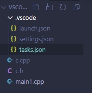
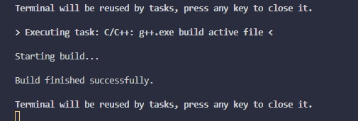
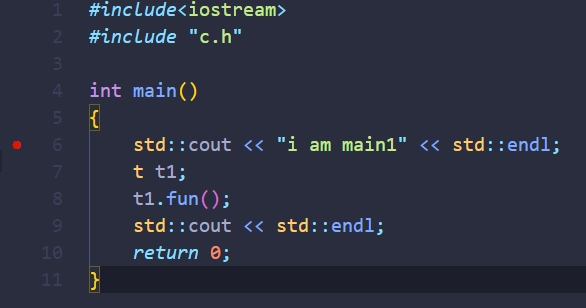
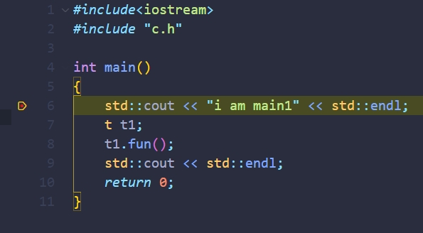

# windows下vscode用MinGW编译多个cpp（一个main）

> author : 刘笑
>
> date : 2020.11.18
>
> remarks : null


在[上篇](https://github.com/lsmilesmile/Environment-Setup/blob/felix/1_0WindowsVscodeMinGWC%2B%2B%E7%8E%AF%E5%A2%83%E9%85%8D%E7%BD%AE%E4%B8%80.md)中运行的程序是在官网的文档下操作的只能编译一个cpp文件，这儿说一下编译多个cpp文件。

首先根据上篇文档的说明实现编译并运行单个cpp文件。下面展示我的

- **目录结构**



接下来展示各个文件的内容，对比上篇文档修改相关配置文件：

- **task.json**

  ```json
  {
  	"version": "2.0.0",
  	"tasks": [
  		{
  			"type": "cppbuild",
  			"label": "C/C++: g++.exe build active file",
  			"command": "E:\\MinGW64\\bin\\g++.exe",
  			"args": [
  				"-g",
  				//"${file}",
  				"${workspaceFolder}\\*.cpp",  // 这儿不改即使只有一个main函数也build不了
  				"-o",
  				//"${fileDirname}\\${fileBasenameNoExtension}.exe"
  				"${workspaceFolder}\\myProgram.exe"
  			],
  			"options": {
  				"cwd": "E:\\MinGW64\\bin"
  			},
  			"problemMatcher": [
  				"$gcc"
  			],
  			"group": {
  				"kind": "build",
  				"isDefault": true
  			},
  			"detail": "compiler: E:\\MinGW64\\bin\\g++.exe"
  		}
  	]
  }
  ```

  

- **launch.json**

  ```json
  {
      // Use IntelliSense to learn about possible attributes.
      // Hover to view descriptions of existing attributes.
      // For more information, visit: https://go.microsoft.com/fwlink/?linkid=830387
      "version": "0.2.0",
      "configurations": [
          {
              "name": "g++.exe - 生成和调试活动文件",
              "type": "cppdbg",
              "request": "launch",
              //"program": "${fileDirname}\\${fileBasenameNoExtension}.exe",
              "program": "${workspaceFolder}\\myProgram",
              "args": [],
              "stopAtEntry": false,
              "cwd": "${workspaceFolder}",
              "environment": [],
              "externalConsole": false,
              "MIMode": "gdb",
              "miDebuggerPath": "E:\\MinGW64\\bin\\gdb.exe",
              "setupCommands": [
                  {
                      "description": "为 gdb 启用整齐打印",
                      "text": "-enable-pretty-printing",
                      "ignoreFailures": true
                  }
              ],
              "preLaunchTask": "C/C++: g++.exe build active file"
          }
      ]
  }
  ```

  

- **c.h**

  ```c++
  #include<iostream>
  
  class t
  {
  public:
      void fun();
  };
  ```

  

- **c.cpp**

  ```c++
  #include "c.h"
  #include<iostream>
  
  void t::fun()
  {
      std::cout << "fun" << std::endl;
  }
  ```

  

- **main1.cpp**

  ```c++
  #include<iostream>
  #include "c.h"
  
  int main()
  {
      std::cout << "i am main1" << std::endl;
      t t1;
      t1.fun();
      std::cout << std::endl;
      return 0;
  }
  ```

下面build(Terminal->Run Build Task)，控制台输出：



打断点：



F5 调试：



这时候断点就过来了，可以调试了。

这儿只是介绍一个main的情况，多个不知道行不行？？。

