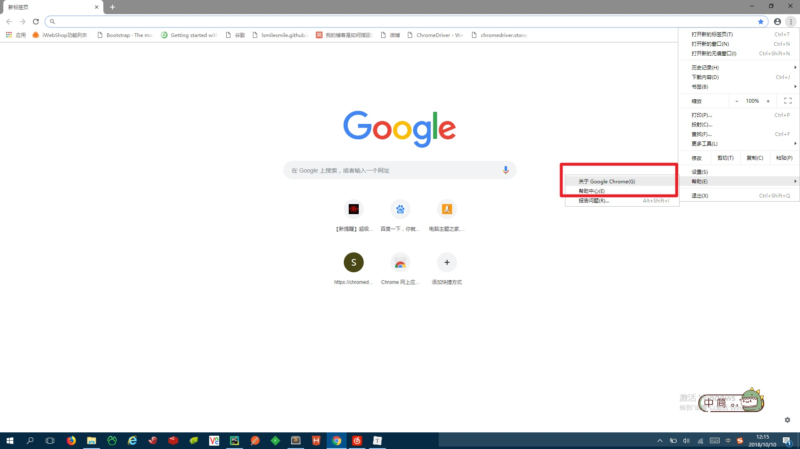
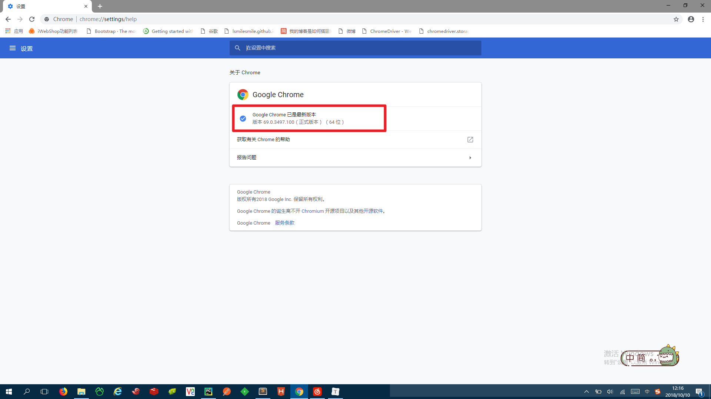
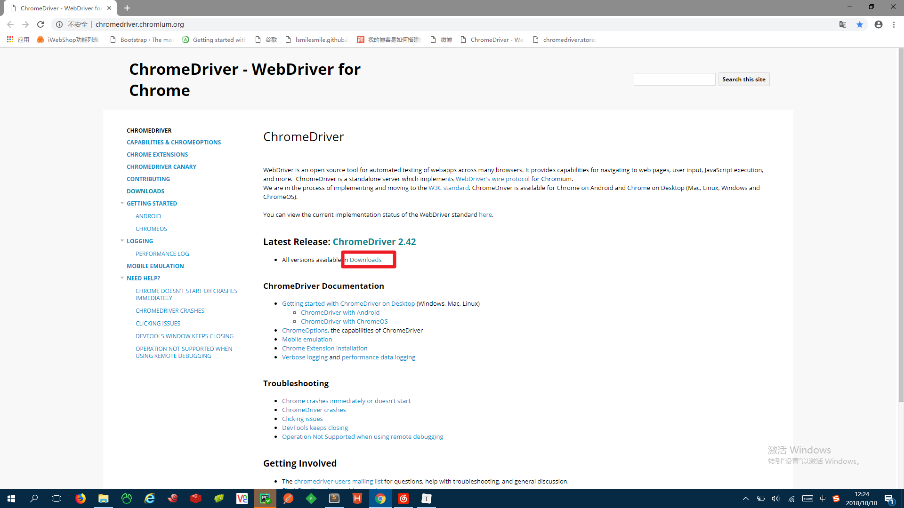
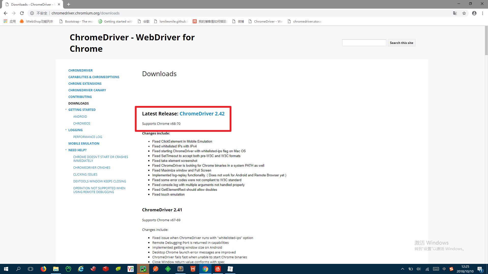
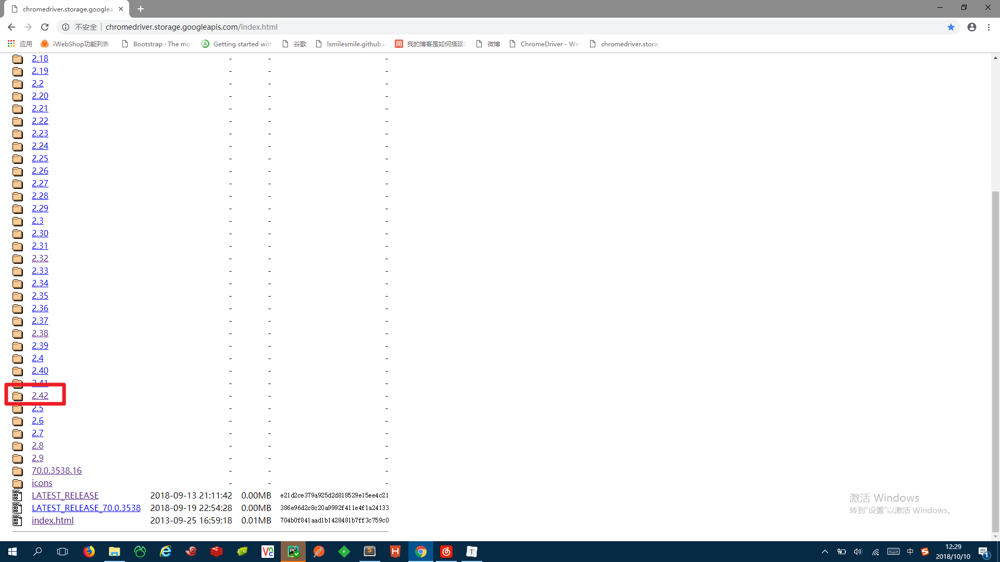
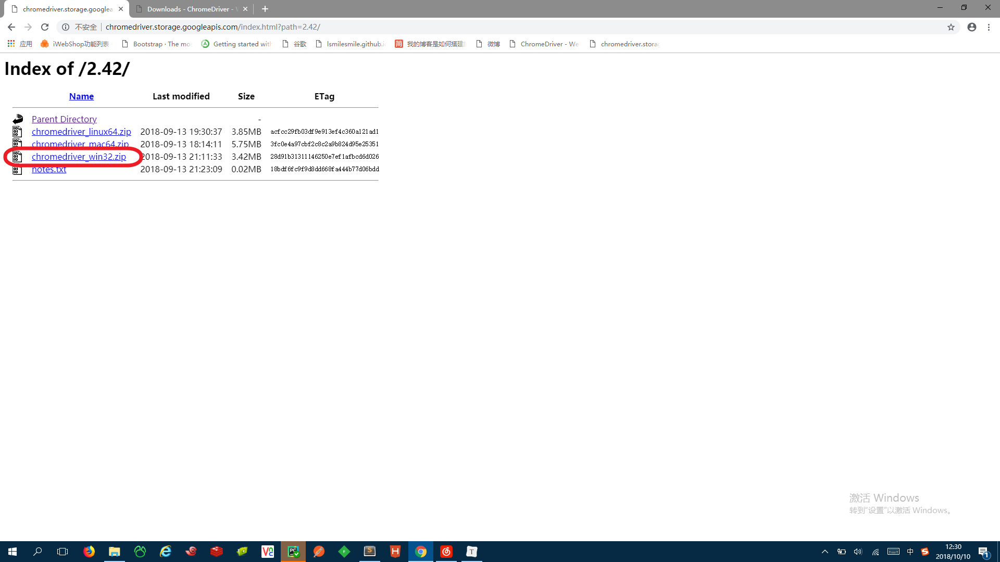
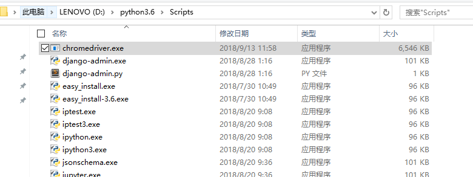
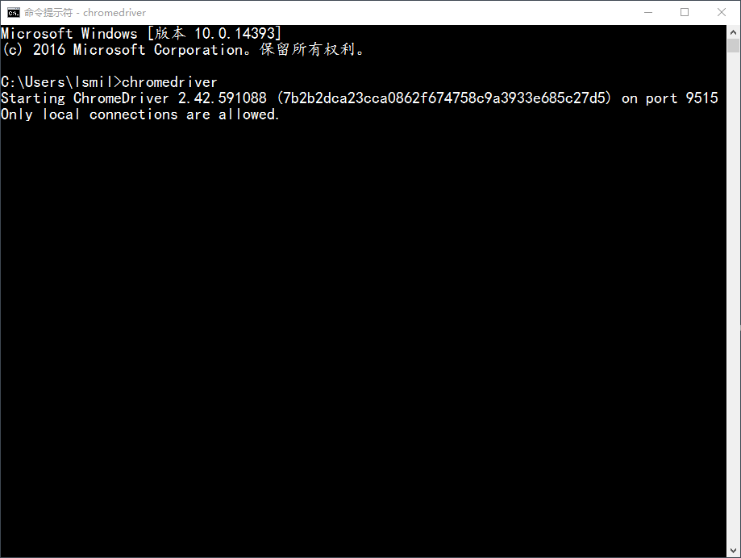

###### ChromeDriver的安装 - windows

1. 先查看谷歌浏览器的版本

   

   

2. 到[官网](http://chromedriver.chromium.org/)找到与该版本对应的ChromeDriver版本，点击Downloads，查看支持版本

   

   

3. 到[镜像库](http://chromedriver.storage.googleapis.com/index.html)下载

   

   

4. 解压

   

5. windows下直接将exe文件放到python安装目录的Scripts目录下

   

6. 检测安装是否完成，直接在命令行下输入chromedriver

   

   成功！

   