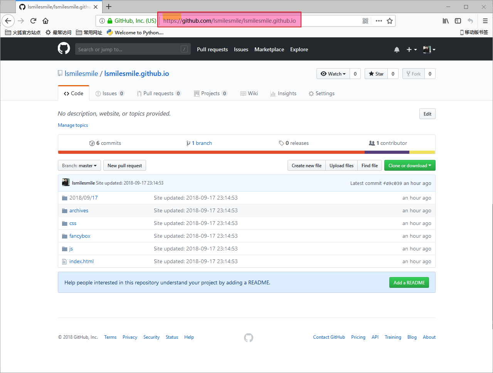
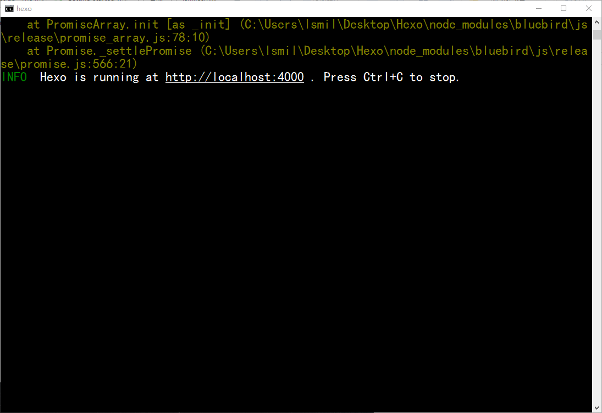
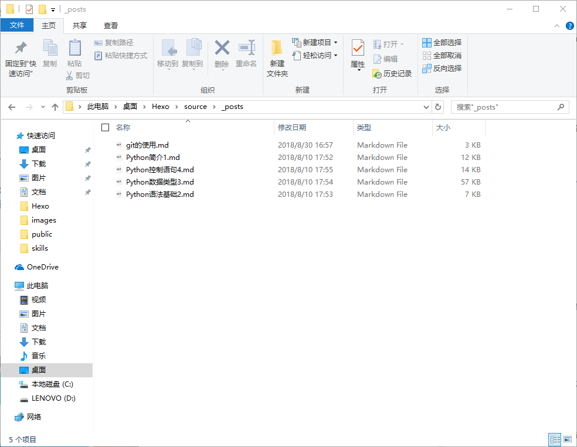

# Hexo+Git pages搭建个人博客

## 前言

该文档的实践是在windows的环境下实现的。

## 准备

github的账号并且已经可以实现代码的提交，如果还没有到这一步，请[点这里](https://github.com/lsmilesmile/skills/blob/master/git%E7%9A%84%E4%BD%BF%E7%94%A8.md)。不过，还是得先注册个git的账号。


## 需要的环境

```
Node.js
Hexo
Git
```

**注：以上是需要安装的环境，且在安装Hexo之前必须安装好Node.js，这里我就不再叙述以上环境怎么安装了，大家可以自己上网查找相关文档**


## 建站

- **建立站点文件夹**

  首先你需要在自己的计算机上有一个专门用来存放你博客文档以及其他配置文件、静态文件等的站点文件夹。打开终端，进入你要存放该文件夹的目录下，执行以下命令：

  ```
  hexo init filename
  cd filename
  npm install
  ```

  **注：filename可以根据自己的喜好取，这儿假设为Hexo**

- **修改配置文件**

  进入到站点文件夹，即Hexo文件，找到\_config.yml文件，用Sublime Text打开，翻到最下面的地方。如下图：

  

  其中的deploy部分按照图中修改，repo即github仓库的地址，如下图粉红色标记的部分：（**注：deploy部分的type，repo，branch刚开始都是与reploy对齐的，这里把它们缩进一下，不然到后面执行相关命令时是个大坑啊。。。且该配置文件中每个冒号“：”后面必须有一个空格**）

  


## 测试

在终端进入到站点文件夹Hexo，执行指令hexo s，如果成功的话则可以看到：



这儿有可能有些不同，但是只要有类似Hexo is running at http://localhost:4000/. Press Ctrl+C to stop的一句话，说明本地服务开启成功了，可以在浏览器中输入localhost:4000来访问。


## 发布

当然这只是本地跑起来了，而你的github pages服务器上并没有，所以你就需要在你的站点里使用终端命令进行发布： 

博文写好之后，在每次发布之前，我们要先将写好的博客生成静态文件，执行以下命令

```
hexo g
```

之后生成的文件会放在./public目录下，这便是我们将要部署到GitHub上的全部内容。

静态文件生成之后，便可以部署到GitHub上

```
hexo d
```

**注1：我们写的博客一般是放在source/\_post文件夹下的**



**注2：还有就是在这里执行hexo d指令时会出现以下错误**

```
You should configure deployment settings in _config.yml first!
Available deployer plugins:
  git
For more help, you can check the online docs: http://hexo.io/
```

以上错误就是由于我上面说的配置文件的缩进问题导致的

到这儿就已经将我们写的文档上传到Git pages上了，可以通过输入https://yourname.github.io来访问了。


## Hexo常用指令

### 指令

```
hexo generate (hexo g)  # 生成静态文件，会在当前目录下生成一个新的叫做public的文件夹
hexo server (hexo s)  # 启动本地web服务，用于博客的预览
hexo deploy (hexo d)  # 部署播客到远端（比如github, heroku等平台）
hexo clean  # 清除缓存文件 (db.json) 和已生成的静态文件 (public)。在某些情况（尤其是更换主题后），如果发现您对站点的更改无论如何也不生效，您可能需要运行该命令。
```

### 指令简写

```
hexo n == hexo new
hexo g == hexo generate
hexo s == hexo server
hexo d == hexo deploy
```

### 指令组合

```
hexo d -g #生成部署
hexo s -g #生成预览
```

下面附上Hexo中文使用文档的链接[Hexo](https://hexo.bootcss.com/docs/)

