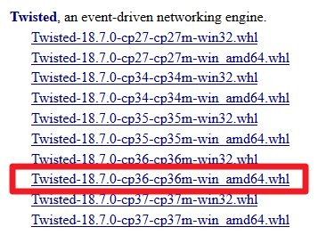

###### Python3.6+Twisted+Scrapy

1. 先安装pyOpenSSL和PyWin32

   ```
   pip install pyopenssl
   pip install pywin32
   ```

2. 安装Twisted

   到该[链接](https://www.lfd.uci.edu/~gohlke/pythonlibs/)下载相关包

   

   执行命令

   ```
   pip install Twisted-18.7.0-cp36-cp36m-win_amd64.whl
   ```

3. 安装Scrapy

   ```
   pip install scrapy
   ```

   